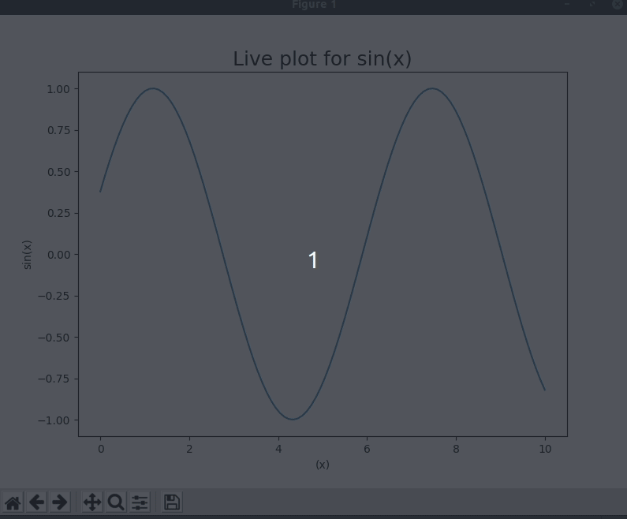

# LivePlot Of Sin(x)

 Simple live plot of sin using matplotlib and numpy. 

## Installations 
First install matplotlib by using the command: _pip install matplotlib_  

Second install numpy by using the command: _pip install numpy_

Finally compile the file in a IDE like VScode or PyCharm, you could also just compile the file from the terminal as well. 

## Demo 
 